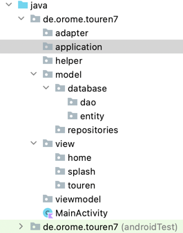

Touren App auf Basis Version 6 mit Room Database, DastaBinding, sdp uns ssp

Versionen und Beschreibung
---------------------------------------------------------------------------------------

---------------------------------------------------------------------------------------

---------------------------------------------------------------------------------------

---------------------------------------------------------------------------------------

---------------------------------------------------------------------------------------

---------------------------------------------------------------------------------------

---------------------------------------------------------------------------------------

---------------------------------------------------------------------------------------

---------------------------------------------------------------------------------------

---------------------------------------------------------------------------------------
Version 0.11
    TourenDetailFragment eingeführt
    DatenModel geändert
    Tour: Spalten tour_sortdaten, tour_anfangs_km, tour_ende_km, tour_gesamt_km
            eingefügt
    TourenDetailFragment Tour als Datenklasse übergeben und Anzeige der Werte tlw. 
    eingerichtet
    
---------------------------------------------------------------------------------------
Version 0.10
    KlickListener auf Listeneintrag führt zur Detailansicht
    Dazu Adapter völlig neu gestaltet
    TourenDetaislsfragment erste Schritte
---------------------------------------------------------------------------------------
Version 0.9
    Activity mit Fragment für RecyclerView Touren
    DataBinding bei Activity, Fragment und ListItem eingefügt
    TourDao, repository und TourenViewModel angepaßt
    TourenListadapter erstellt
    Navigation zur Listenansicht nach Einage der Daten bzw Abbruch der Eingabe
---------------------------------------------------------------------------------------
Version 0.8
    Dialog Datumseingabe
    Dialoge zur Eingabe der Zeiten für COS-Zeit, Depotzeit vor und nach Tour
---------------------------------------------------------------------------------------
Version 0.7
    TourenDatabase erstellt
    TourenRepository.kt erstellt
    TourenViewModel Teil 1
    TourenViewModelFactory erstellt
    MainActivity DataBinding eingestellt und Buttons mit Funktionen "belebt"
---------------------------------------------------------------------------------------
Version 0.6 
    TourDao erstellt
---------------------------------------------------------------------------------------
Version 05. Tour Entity erstellt
TourenActivity gestaltet
Dataclass Tour.kt eingefügt
---------------------------------------------------------------------------------------
Version 0.4
    Packages eingefügt
    Bildschirmausschnitt:
    
    Splashscreen eingeführt funktioniert nicht
    => Start mit MainActivity
---------------------------------------------------------------------------------------
Version 0.3
    Strings angepasst
    dimens.xml eingefügt
---------------------------------------------------------------------------------------
Version 0.2
    Farben angepasst
    Animation für Splashscreen hinzugefügt
    Themes angepaßt
---------------------------------------------------------------------------------------
master und Version 0.1:
    GrundApp ohne Änderungen außer 
    INFO.md und den dependencies